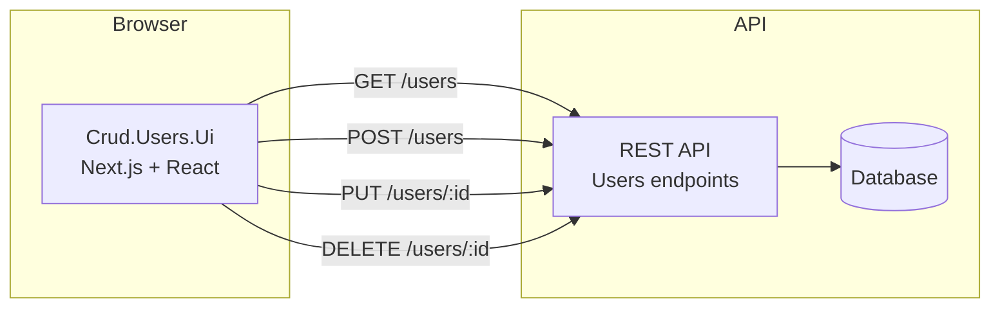
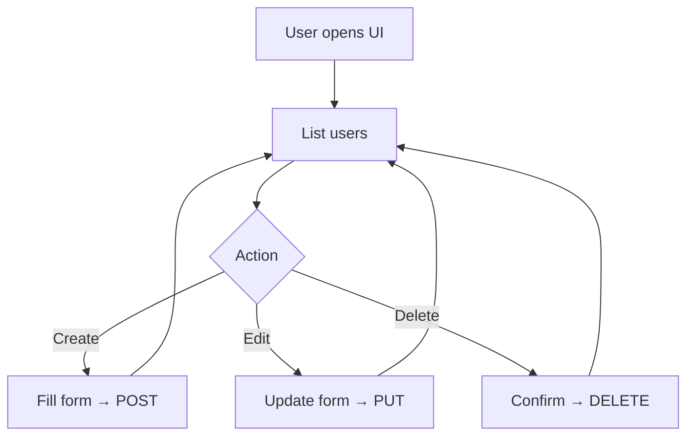

# Crud.Users.Ui
Frontend for a user management UI built with [Next.js](https://nextjs.org). The goal is to provide Create, Read, Update, and Delete operations against a REST API for user data.

> **Status:** Work in progress. The repo currently contains the Next.js + TypeScript + Tailwind starter. CRUD screens and API integration are not implemented yet.

## Tech stack
- [Next.js](https://nextjs.org) 15 (App Router)
- React 19
- TypeScript
- Tailwind CSS 4

## Architecture




## Getting started
### Prerequisites
- Node.js 18+ recommended
- npm, yarn, pnpm, or bun

### Install and run
```bash
npm install
npm run dev
```

Open [http://localhost:3000](http://localhost:3000) in your browser.

Other package managers:

```bash
yarn dev
# or
pnpm dev
# or
bun dev
```

### Scripts
| Command         | Description              |
| --------------- | ------------------------ |
| `npm run dev`   | Start development server |
| `npm run build` | Production build         |
| `npm start`     | Run production server    |

## Project structure
```
app/
  layout.tsx    # Root layout
  page.tsx      # Home page
  globals.css   # Global styles
public/         # Static assets
```

## Environment variables
If you add API URLs or secrets later, use a `.env.local` file (already ignored by git):

```bash
# .env.local (example — do not commit real values)
NEXT_PUBLIC_API_URL=http://localhost:5000
```

## Learn more
- [Next.js Documentation](https://nextjs.org/docs)
- [Learn Next.js](https://nextjs.org/learn)
